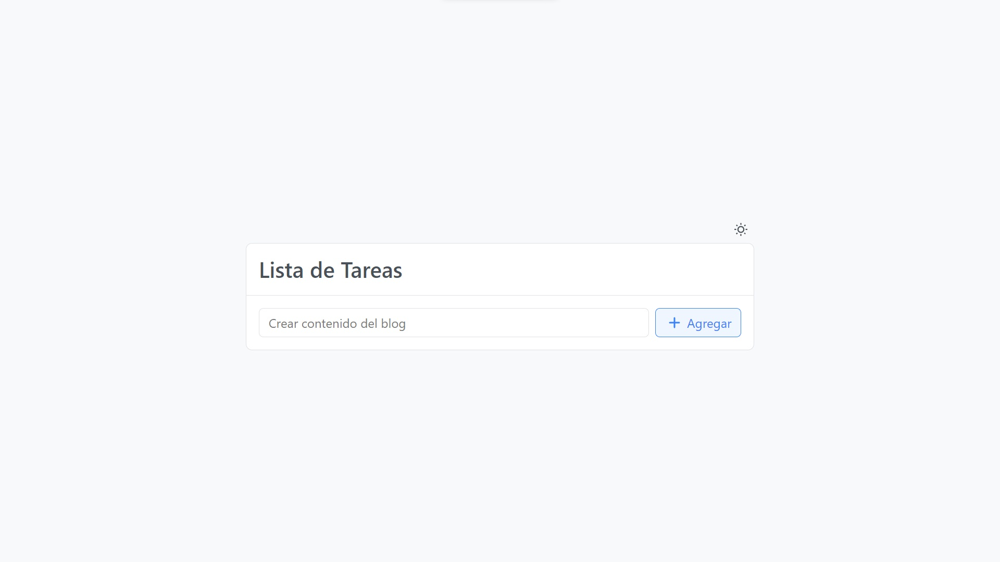
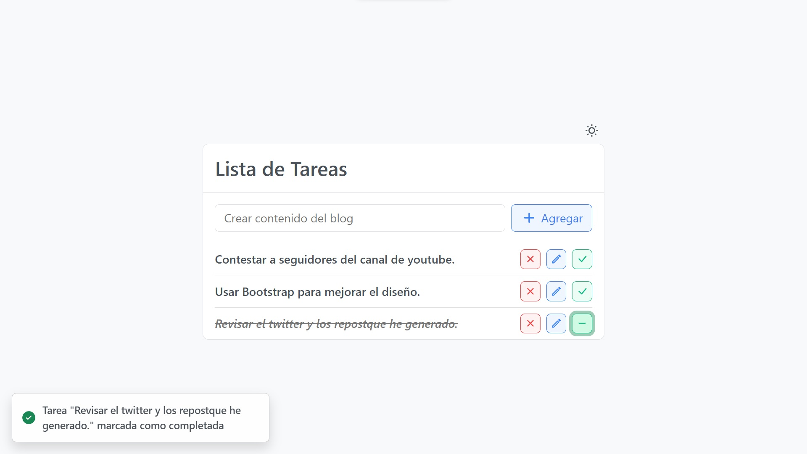

# Prueba: Lista de Tareas

Prueba de nivel intermedio

## Tecnologías
- PHP
- Laravel
- Composer
- MySQL
- Node.js
- Vue 3
- Vite
- Bootstrap 5

## Requerimientos para reproducción
- Descargar e Instalar [GitHub CLI](https://cli.github.com/)
- Descargar e Instalar PHP y MySQL, yo he utilizado [XAMPP](https://www.apachefriends.org/es/download.html) (PHP 8.2.4) como entorno
- Dentro de la carpeta `C:\xampp\php`, habilitar la extensión zip en el archivo `php.ini` de PHP si es necesario para habilitar la instalación de los paquetes de composer
- Descargar e instalar [Composer](https://getcomposer.org/download/) (2.5.8)
- Descargar e instalar [Node.js](https://nodejs.org/en/download) (18.16.1)
- Instalar PNPM utilizando el comando `npm install pnpm@latest -g`

## Pasos de instalación del proyecto
1. Clonar el repositorio de GitHub.

```sh
gh repo clone Yizack/prueba-intermedio-tareas
```

2. Cambiar de directorio

```sh
cd prueba-intermedio-tareas
```

3. Para instalar paquetes de composer del proyecto ejecutar

```sh
composer install
```

4. Comando para instalar paquetes npm utilizando PNPM

```sh
pnpm install
```

5. Renombrar el archivo `.env.example` a `.env` para hacer uso de las variables de entorno.

## Pasos para ejecutar el proyecto

Para la ejecución del proyecto se necesitará realizar los siguientes pasos.

1. Iniciar Apache y MySQL por ejemplo en XAMPP


2. Abrir una consola en el directorio del proyecto y ejecutar el siguiente comando para realizar la migración de la base de datos

```sh
php artisan migrate
```

3. Ejecutar la build de Vue con Vite

```sh
pnpm build
```

3. Para iniciar el servidor, ejecutar

```sh
php artisan serve
```

4. Acceder a la dirección http://localhost:8000 en el navegador.

5. Pantalla inicial si todo se ha ejecutado correctamente.



## Ejemplo

Captura del funcionamiento



## Desarrollo

Para realizar cambios en entorno de desarrollo

1. Ejecutar el comando de entorno de desarrollo de Vite

```sh
pnpm dev
```

2. En otra consola sin cerrar la consola anterior, ejectuar el servidor

```sh
php artisan serve
```

## REST API

Puntos finales de la API

| Endpoint          | Método | Descripción              |
|-------------------|--------|--------------------------|
| `/api/tareas`     | GET    | Obtener todas las tareas |
| `/api/tareas`     | POST   | Crear tarea              |
| `/api/tareas/:id` | PUT    | Modificar tarea          |
| `/api/tareas/:id` | DELETE | Eliminar tarea           |
| `/api/tareas/:id` | PATCH  | Completar tarea          |


## Información adicional (Base de datos)

### Laravel

El framework de Laravel nos permite crear migraciones de nuestra estructura de base de datos fácilmente utilizando el directorio `database/migrations` con código PHP. Por ejemplo, ver el archivo [`tareas_table.php`](/database/migrations/tareas_table.php)

Igualmente también nos facilita la creación de rutas de nuestra api utilizando el directorio `routes` y el archivo [`api.php`](/routes/api.php), a estas rutas podemos asignarles funciones de un controlador para obtener las tareas y realizar las modificaciones de nuestra base de datos.

El archivo del controlador de tareas donde se encuentran las acciones está localizado en [`app/Http/Controllers/TareaController.php`](app/Http/Controllers/TareaController.php)

### Instrucciones SQL

Para motivos de demostración de conocimiento también he creado un archivo con instrucciones para crear la tabla de la base de datos y los procedimientos de almacenado en caso de que no exista una opción de migración de base de datos como la que ofrece Laravel.

El archivo con las instrucciones se puede encontrar en [`db.sql`](/db.sql)
